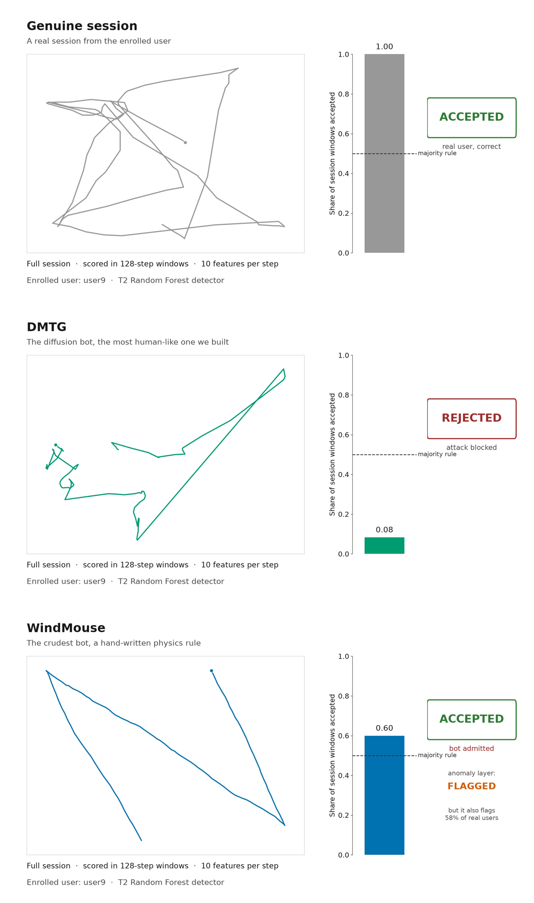
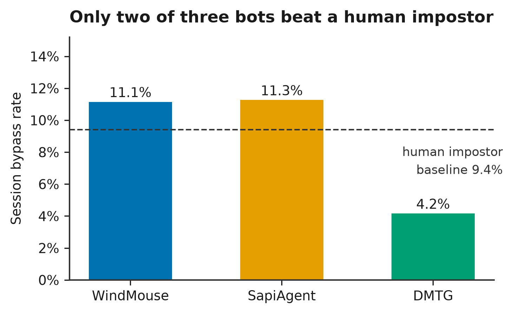

# Behavioral Authentication Under Attack

## Authors
- Elbert Henriquez (@ElbertH21)
- Mahnoor Shahid (@mahnoorshahidx)

**AI Mouse Bots, Human Impostors, and User-Specific Vulnerability**

Behavioral authentication watches *how* you move a mouse and continuously checks that you are still you — so a stolen password isn't the end of the story. It was designed to catch human impostors. Bots are a newer question.



*The system running against one enrolled user. Top: a genuine session, accepted.
Middle: the diffusion bot, rejected. Bottom: the crudest bot — a hand-written
physics rule — accepted, then caught by the anomaly layer. On this user the
simplest attack beats the most advanced one.*
[Watch the full 60-second demo →](video/abast_demo.mp4)

We tested it against three generations of mouse-movement bot — a hand-written physics rule, a trained autoencoder, and a diffusion model — across four defender tiers, and scored **real human impostors through the same pipeline** so every bypass rate has a bar to clear.

NSF REU 2026 · AI-Empowered Cybersecurity · University of Missouri–Kansas City
Elbert Henriquez · Mahnoor Shahid · Advisors: Dr. Rui Duan, Dr. Yugyung Lee

---

## Three questions

**1. How does attack success change as bots get more sophisticated, and how do they compare with real human impostors?**

Bots did not raise the bar. WindMouse bypassed 11.1% of sessions and SapiAgent 11.3%, barely above the **9.4% real human-impostor baseline**. The most sophisticated bot — the diffusion model — reached only 4.2%, never clearing the human bar. Sophistication did not translate into threat.



**2. Are some users more vulnerable than others, and does the strongest attacker depend on the target?**

Yes, and this is the sharpest finding. Vulnerable sets are largely disjoint: one user blocked WindMouse entirely (0.0%) but fell to SapiAgent 44.3% of the time. An attacker free to choose the best tool per target succeeds **20.3%** of the time — nearly double the best single bot.

**3. Can additional defenses improve robustness without substantially reducing legitimate-user acceptance?**

Not with what we tested. The anomaly layer cut synthetic bypass from 0.56% to 0.00%, but genuine-user acceptance fell from 53.7% to 22.6%, flagging **58.4%** of genuine sessions. Every threshold here was calibrated for security alone (FAR ≤ 0.10); calibrating toward usability is untested.

---

## Headline numbers

| Claim | Value | Source CSV |
|---|---|---|
| WindMouse session bypass | 11.15% | `all_attack_results_corrected.csv` |
| SapiAgent session bypass | 11.26% | same |
| DMTG session bypass | 4.16% | same |
| **Real human-impostor baseline** | **9.40%** | `a0_baseline_session_corrected.csv` |
| Best tool per target (upper bound) | 20.30% | mean of per-user max |
| Genuine sessions flagged by anomaly layer | 58.43% | `layered_defense_session_level.csv` |
| Best clean AUC (T2) | 0.8650 | `clean_defender_results_corrected.csv` |

All bypass rates are tier-equal-weighted (mean within tier, then unweighted mean across tiers) under the `calibration_FAR<=0.10` policy, over 10 users × 3 seeds × 4 defender tiers.

Every number above is reproducible from `results/leakage_free/` via `make_poster_figures.py`, which writes `figure_numbers_audit.txt` alongside the figures. Diff that audit between runs to catch any movement.

---

## Scope and limitations

- **Ten users, one dataset, one interaction context.** We do not claim these rates generalize. The contribution is the evaluation framework and the human baseline that makes bypass rates interpretable.
- **All three bots are target-blind.** They never query the detector, observe its decisions, or adapt. Reported bypass rates are a lower bound on what an adaptive attacker could achieve.
- **The 20.3% figure is a construction, not an observed attack.** It is the mean of each user's worst case, assuming an attacker who already knows which tool works against that person. We did not build one that does the selecting.
- **Balabit is remote-desktop administrator sessions.** Results do not transfer to other interaction contexts without retesting.

---

## Start here

- **Canonical run:** `defender/notebooks/Week8_ABAST_canonical.ipynb` — the leakage-free corrected evaluation. Every reported number comes from it.
- **Canonical results:** `results/leakage_free/` — the corrected CSVs every figure and claim traces back to.
- **Figures:** `make_poster_figures.py` regenerates all seven poster figures plus the numbers audit.
- **Demo:** `make_demo_animation.py` renders the 60-second system demonstration.

Defender notebooks are READ-ONLY reference — they execute in Colab against Drive + GPU, not locally. The canonical notebook keeps its executed outputs as an evidence trail, so you can see what the run actually produced; Week7_BehavioralAuth.ipynb is stripped.

---

## Repository layout

```
reu-sapiagent/
├── README.md
├── make_poster_figures.py     regenerates all figures + numbers audit
├── make_demo_animation.py     renders the 60 s demo video
├── attacker/                  generator code only (no generated data)
│   ├── windmouse/             hand-written physics rule
│   ├── sapiagent/             autoencoder pipeline + emitter
│   └── dmtg/                  diffusion-based generator
├── defender/notebooks/        defender + scoring notebooks (read-only reference)
├── results/
│   ├── leakage_free/          canonical corrected CSVs
│   └── figures/poster/        committed PNG + SVG figures, numbers audit
├── video/                     rendered demo
├── poster/  paper/            poster and manuscript sources
└── data/                      gitignored — see data/README.md
```

Not committed: the Balabit dataset (`Mouse-Dynamics-Challenge/`), the upstream SapiAgent source (`sapiagent/`), virtual environments, model checkpoints, and scratch artifacts (`a2/`). Each is obtained or regenerated per the instructions below.

---

## Third-party code and data

**We do not redistribute either.** Both are used in place and must be obtained separately:

- **SapiAgent** — clone from [margitantal68/sapiagent](https://github.com/margitantal68/sapiagent), then set `SAPIAGENT_ROOT`. Antal, Fejér & Buza, *IEEE Access* 9, 2021. Their repository states no license; it is referenced, not vendored.
- **Balabit Mouse Dynamics Challenge** — clone from [balabit/Mouse-Dynamics-Challenge](https://github.com/balabit/Mouse-Dynamics-Challenge), then set `BALABIT_ROOT`.

Our DMTG-style generator is an independent implementation from the published description; it drops the style-transfer module and is target-blind. No DMTG code was available to copy.

---

## Reproducing

Paths are configured by environment variable, each with a repo-relative default:

| Variable | Default | Purpose |
|---|---|---|
| `BALABIT_ROOT` | `./data/Mouse-Dynamics-Challenge` | Balabit dataset clone |
| `SAPIAGENT_ROOT` | `./sapiagent` | upstream SapiAgent source |
| `WINDMOUSE_SRC` | `./attacker/sapiagent/realism_step8.py` | WindMouse export source |
| `WINDMOUSE_OUT` | `./a2/handoff/windmouse_sessions` | WindMouse session output |

**Figures and the numbers audit:**

```bash
python make_poster_figures.py --input ./results/leakage_free --output ./results/figures/poster
```

**Demo video** (needs `demo_scores_user9.csv` and `demo_trajectories_user9.csv`):

```bash
python make_demo_animation.py --input ./results --output ./video
```

**Regenerating each attacker's sessions** — each writes Balabit-format sessions into its `data/` subfolder:

- **WindMouse** → `python attacker/windmouse/save_windmouse_csvs.py`
- **SapiAgent** → run `attacker/sapiagent/` step scripts in order: `build_actions_step3.py` → `train_step4.py` → `gen_step5.py` → `generate_step7.py` → `handoff_step9.py` (realism metrics via `realism_step8.py`)
- **DMTG-style** → `python attacker/dmtg/train.py` → `sample.py` → `emit.py`

SapiAgent and DMTG share the pooled-Balabit corpus and the per-step timing sampler; only the generative mechanism differs. Generated sessions are handed to the defender notebook, which produces the bypass tables in `results/`.

**Environment:** attacker and diffusion training run locally (WSL2, RTX 5070) on TensorFlow and PyTorch in separate venvs. Defender scoring runs in Google Colab on TensorFlow. Keep the two separate.

---

## References

- Antal, M., Fejér, N., & Buza, K. (2021). SapiAgent: A Bot Based on Deep Learning to Generate Human-Like Mouse Trajectories. *IEEE Access*, 9. doi:10.1109/ACCESS.2021.3103956
- Liu, J., Cui, Z., Ge, W., & Zhan, P. (2024). DMTG: A Human-Like Mouse Trajectory Generation Bot Based on Entropy-Controlled Diffusion Networks. arXiv:2410.18233
- Land, B. (2021). WindMouse: An Algorithm for Generating Human-Like Mouse Motion. https://ben.land/post/2021/04/25/windmouse-human-mouse-movement/
- Fülöp, Á., Kovács, L., Kurics, T., & Windhager-Pokol, E. (2016). Balabit Mouse Dynamics Challenge Data Set. https://github.com/balabit/Mouse-Dynamics-Challenge

---

## Acknowledgements

Supported by the National Science Foundation under NSF Grant No. CNS-2349236 through the Summer 2026 AI-Empowered Cybersecurity REU Site at the University of Missouri–Kansas City. Computational resources provided by UMKC.

Any opinions, findings, conclusions, or recommendations expressed in this material are those of the authors and do not necessarily reflect the views of the National Science Foundation.
